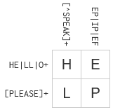

# Lab 01 Report - Introduction to Open Source Software

## 0. Setup
[index.md](../../index.md)

## 1. Join Discord

## 2. Reading Assignments
### Open Source Definition
The definition of open source goes beyond making the source code available. Open source means that the software or product is expected to be extended and made accessible to all.

### Smart Questions
1. Demonstrate that you have researched the problem yourself and the steps you have taken so far.
2. Make a note if you solved the problem yourself, so other people don't waste their time solving it, and so they can learn from your solution.

### Free Culture
What I got out of this chapter is that the world is divided into two groups of people. The first is those who innovate by researching and developing new technologies and helping others to benefit the world. The other group is the villains who take advantage of these innovators for their own good. In this instance, Jesse was improving a technology that serves an extremely important role in the usability of the world wide web, and did not do anything wrong. Whether the RIAA knew this or not, they still wanted to exploit the situation and clean him out for their own gain. This behavior is problematic not just because it is wrong, but because of the impact it has on tinkerers like Jesse. How many people out there are afraid to tinker out of fear of situations like this one? How many new technologies have had their development held back?

## 3. Linux

## 4. Regex

## 5. Blockly

## 6. Reflection
An open source project that interests me is VyOS, a software based routing platform. This project interests me because it gives you an enterprise-grade feature set without needing special hardware or licensing. Being open source, the community is able to implement feature sets to keep it competitive with other solutions. Personally, there is certain functionality that I feel is missing that I could see myself attempting to implement.