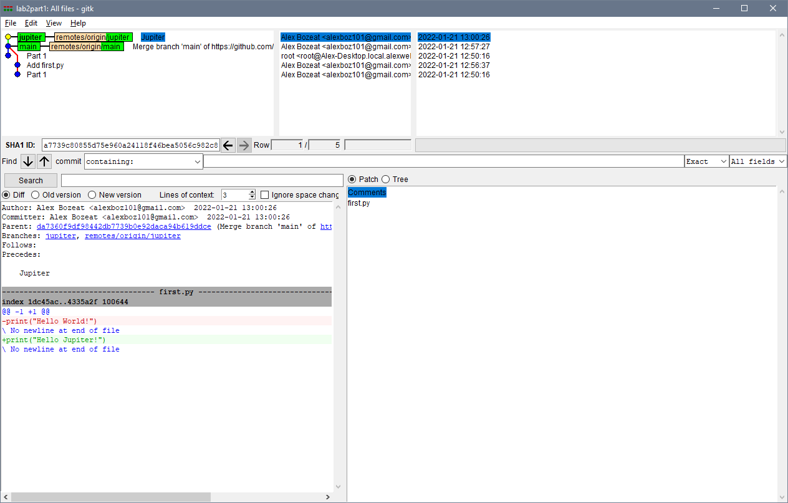
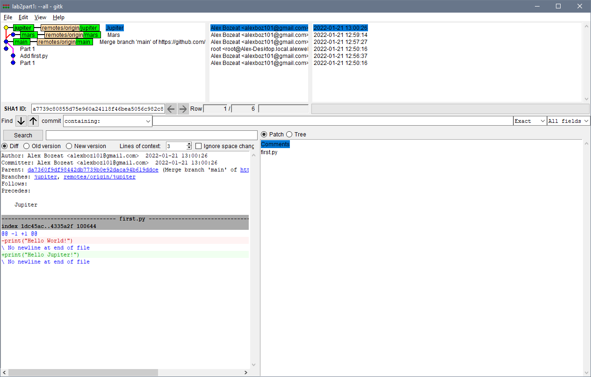
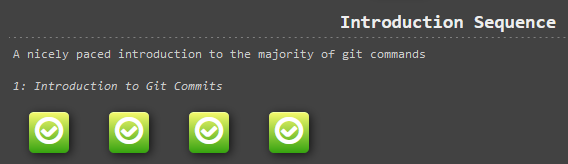

# Lab 02 Report - Git

## Part 1
[lab2part1 Repository](https://github.com/alexboz/CSCI-4470_lab2part1)





```
* a7739c8 (HEAD -> jupiter, origin/jupiter) Jupiter
*   da7360f (origin/main, main) Merge branch 'main' of https://github.com/alexboz/CSCI-4470_lab2part1
|\
| * 28bf4ef Part 1
* e8545e6 Add first.py
* 0788bf8 Part 1
```

## Part 2
[Spoon-Knife Repository](https://github.com/alexboz/Spoon-Knife)



## Part 3
[PullReq Repository](https://github.com/alexboz/PullReq)

```
diff --git a/Spring2022/AlexBozeat.md b/Spring2022/AlexBozeat.md
new file mode 100644
index 0000000..f0d09eb
--- /dev/null
+++ b/Spring2022/AlexBozeat.md
@@ -0,0 +1 @@
+1/21/2022
\ No newline at end of file
```

```
1.0.0
```

[OSSProjectIdeas Repository](https://github.com/vandek5/OSSProjectIdeas)
