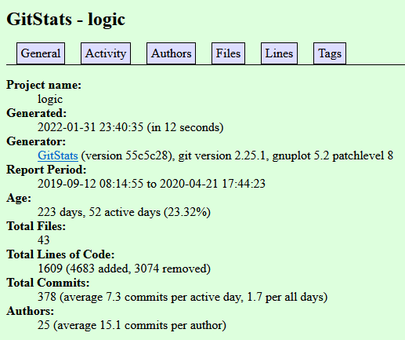
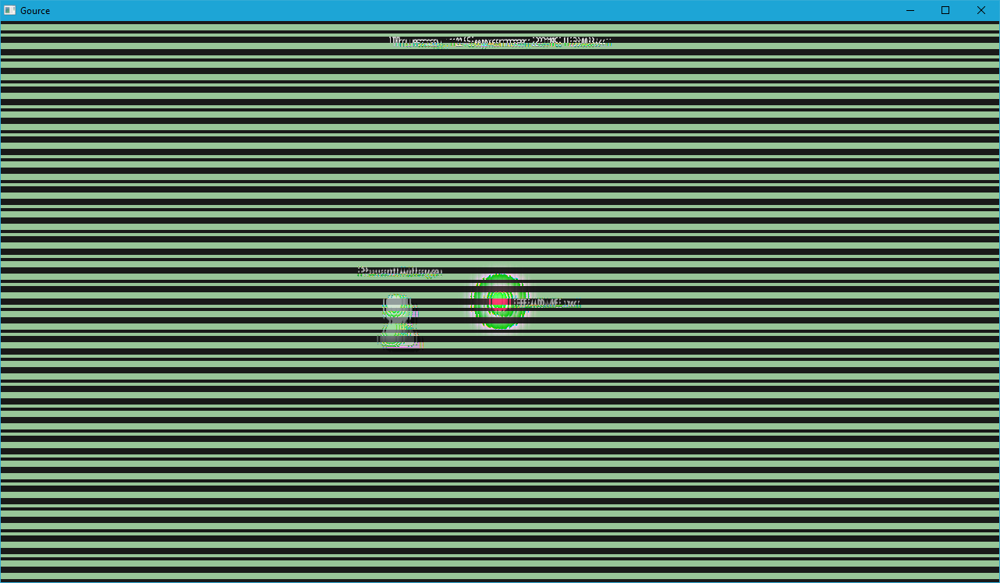
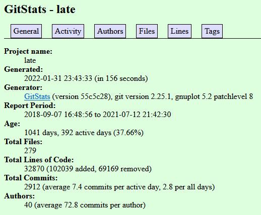
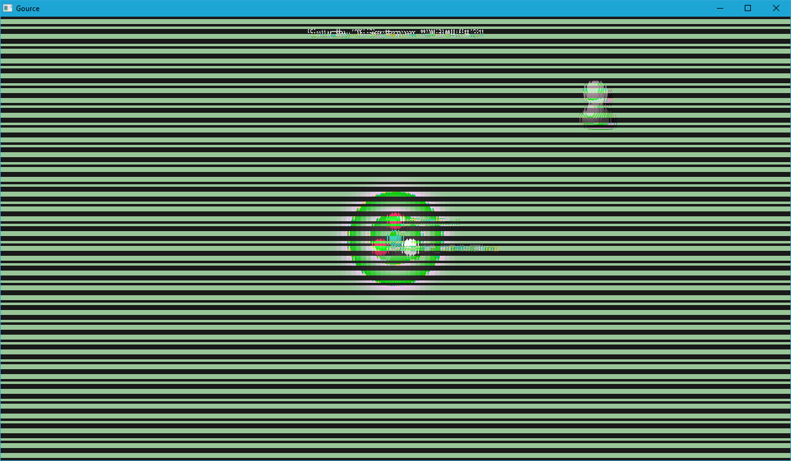
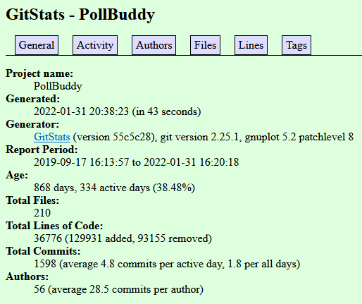
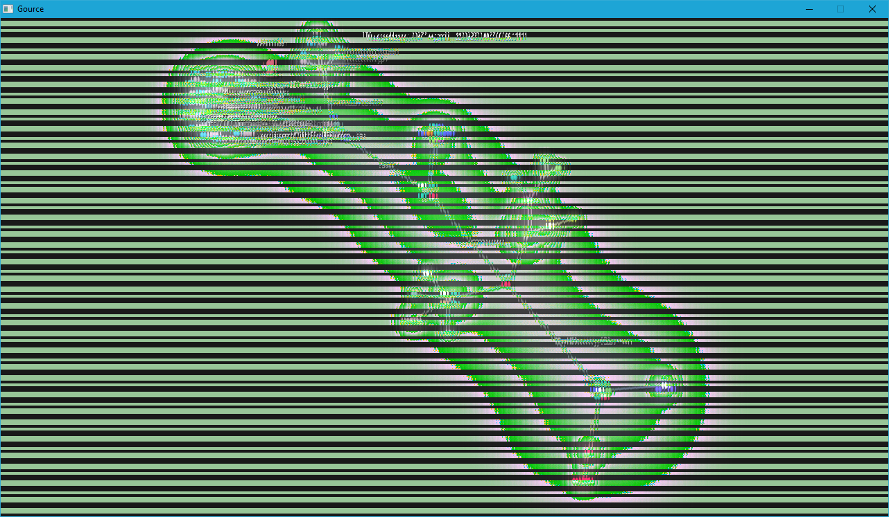
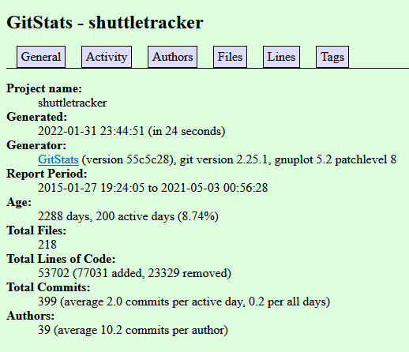
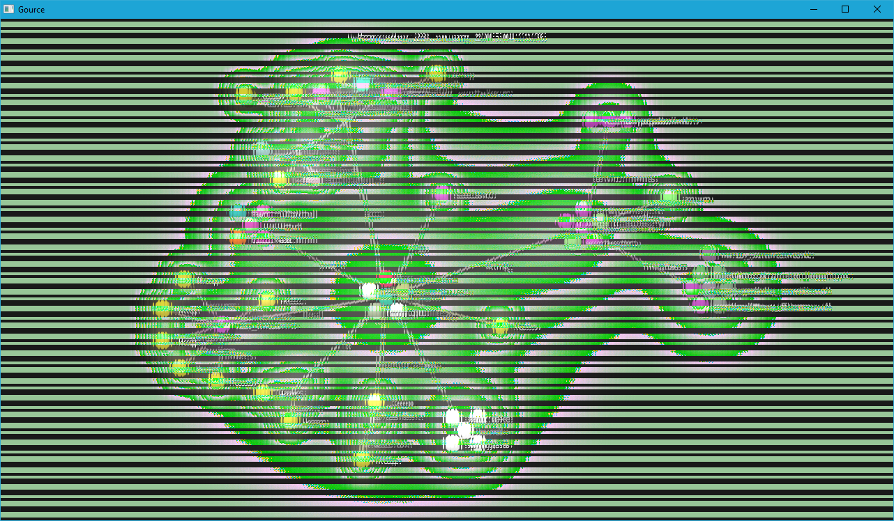

# Lab 03 Report - Documentation and Community

## Part 1
[Link to Wiki Page](https://github.com/alexboz/CSCI-4470/wiki/Lab-3-Part-1)

## Part 2
### ALPACA

https://github.com/rpi-alpaca/logic

- 19 contributors
- 1732 lines of code
- First commit: a8b820a on Thu Sep 12 08:14:55 2019 -0400
- Latest commit: c2f77be on Tue Apr 21 17:44:23 2020 -0400
- Current Branches:
  - master
  - remotes/origin/ConditionalElim
  - remotes/origin/HEAD -> origin/master
  - remotes/origin/first-order-logic
  - remotes/origin/first-order-negation
  - remotes/origin/logic-gate
  - remotes/origin/master
  - remotes/origin/testing

### LATE

https://github.com/Apexal/late

- 25 contributors
- 68809 lines of code
- First commit: 5248bf4 on Fri Sep 7 16:48:56 2018 -0400
- Latest commit: 320f27e on Mon Jul 12 21:42:30 2021 -0400
- Current Branches:
  - dev
  - remotes/origin/HEAD -> origin/dev
  - remotes/origin/dev
  - remotes/origin/master

### Poll Buddy

https://github.com/PollBuddy/PollBuddy

- 38 contributors
- 37520 lines of code
- First commit: af1c1a0 on Tue Sep 17 16:13:57 2019 -0400
- Latest commit: c0c0d77 on Mon Jan 31 16:20:18 2022 -0500
- Current Branches:
  - master
  - remotes/origin/Backend-Lint-Cleanup
  - remotes/origin/Groups-Redirect
  - remotes/origin/HEAD -> origin/master
  - remotes/origin/Lazy-Loading
  - remotes/origin/backend
  - remotes/origin/backend_datavalidate
  - remotes/origin/dependabot/npm_and_yarn/PollBuddy-Server/frontend/follow-redirects-1.14.7
  - remotes/origin/dependabot/npm_and_yarn/PollBuddy-Server/frontend/nanoid-3.2.0
  - remotes/origin/frontend
  - remotes/origin/group-frontend-integration
  - remotes/origin/groups-id-edit
  - remotes/origin/groups-new
  - remotes/origin/issue281-login-wheel
  - remotes/origin/leave-group-functionaity
  - remotes/origin/loadingwheel-register-school
  - remotes/origin/login-spinning-wheel
  - remotes/origin/master
  - remotes/origin/polls-edit-fix
  - remotes/origin/polls-id-delete
  - remotes/origin/questionEditorFunctionality
  - remotes/origin/sbolla-PollBuddy
  - remotes/origin/users-id-edit

### Shuttle Tracker

https://github.com/wtg/shuttletracker

- 30 contributors
- 58274 lines of code
- First commit: 3453b12 on Tue Jan 27 19:24:05 2015 -0500
- Latest commit: aa70198 on Mon May 3 00:56:28 2021 -0400
- Current Branches:
  - master
  - remotes/origin/HEAD -> origin/master
  - remotes/origin/Stop-Editing
  - remotes/origin/Stop-Editing-Dropdown
  - remotes/origin/TV-Panel
  - remotes/origin/TV-Panel-Fall2019
  - remotes/origin/april-1
  - remotes/origin/bus_button_always_on
  - remotes/origin/change-tabbar-size
  - remotes/origin/contribution-guidelines
  - remotes/origin/dark-theme
  - remotes/origin/debugRecording
  - remotes/origin/dependabot/npm_and_yarn/frontend/follow-redirects-1.14.7
  - remotes/origin/doc
  - remotes/origin/dockerignore
  - remotes/origin/documentation
  - remotes/origin/dokku-nginx-conf
  - remotes/origin/eta_refactored
  - remotes/origin/feature_msg
  - remotes/origin/feedback
  - remotes/origin/feedback2
  - remotes/origin/github_corner
  - remotes/origin/import-json
  - remotes/origin/master
  - remotes/origin/message-display
  - remotes/origin/notification_frontend
  - remotes/origin/notifications
  - remotes/origin/polyLine_overlap
  - remotes/origin/prediction_test
  - remotes/origin/readme-changes
  - remotes/origin/redirect
  - remotes/origin/route-rewrite
  - remotes/origin/route-scheduling
  - remotes/origin/routes_cleanup
  - remotes/origin/sample-vue
  - remotes/origin/shuttle-slide
  - remotes/origin/smooth-tracking
  - remotes/origin/smooth-tracking-algorithm
  - remotes/origin/smooth-tracking-algorithm-2
  - remotes/origin/smooth-tracking-algorithms
  - remotes/origin/smooth-tracking-predict-light-stops
  - remotes/origin/smooth-tracking-slide
  - remotes/origin/smooth-tracking-test
  - remotes/origin/smooth_tracking_debug
  - remotes/origin/stop_ordering
  - remotes/origin/stops-editing
  - remotes/origin/test
  - remotes/origin/toggle-routes
  - remotes/origin/troubleshooting
  - remotes/origin/tv-panel
  - remotes/origin/typescriptvue
  - remotes/origin/update-contribution-guidelines
  - remotes/origin/vehicle-stop-location
  - remotes/origin/view-feedback

### Gitstats Comments
The line count is different because gitstats does not count empty lines. There are also some duplicate authors listed with some users having their username and full name listed, so a potential improvement would be to combine these like GitHub does.
