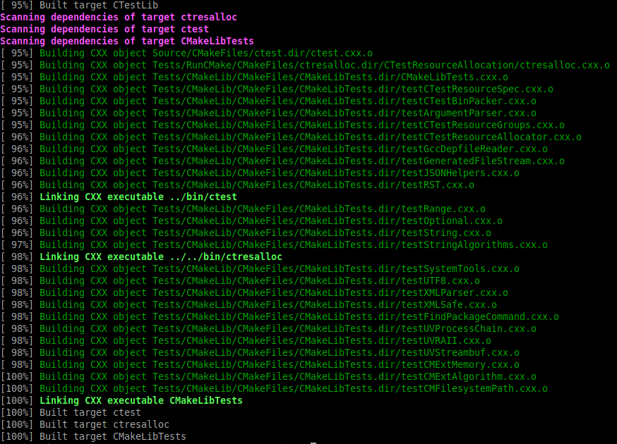
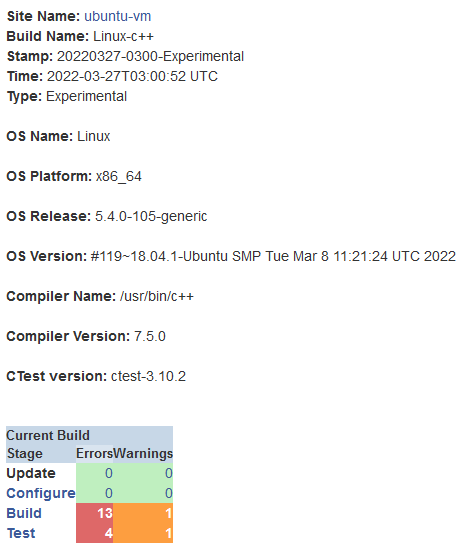

# Lab 07 Report - Testing and Continuous Integration

## Checkpoint 1

## Checkpoint 2
1. 
   - Click on the name of a build, scroll all the way down, and click on "View Tests Summary".
   - One submission failed a memcheck test ([https://open.cdash.org/test/652125012]()). It appears that the Valgrind test did not run properly, as there was no output from the program. To debug this the stdout and stderr are given, along with the call stack.
   - [This](https://open.cdash.org/build/7818109) build has a similar configuration to mine. The dashboard is clean with 0 errors.
2. [My Submission](https://open.cdash.org/build/7818429)

    

