# Lab 09 Report - Databases

## Checkpoint 0: Project Updates
[Blog](https://github.com/alexboz/CSCI-4470/wiki/Blog)

## Checkpoint 1: Install CouchDB
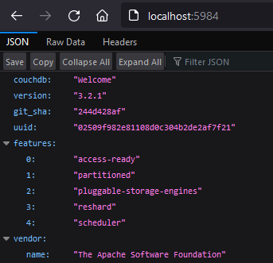

## Checkpoint 2: Quick Tour
### 1.6.1
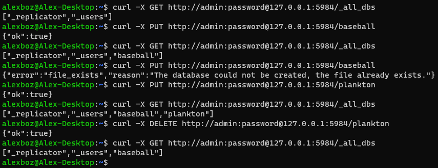

### 1.6.2
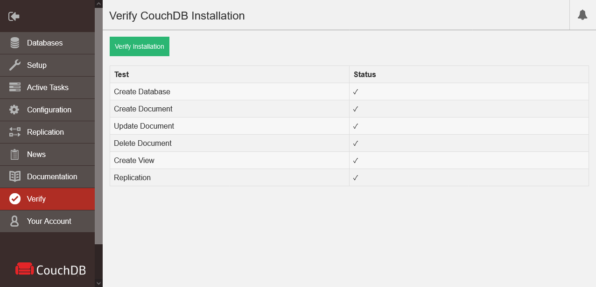

### 1.6.3
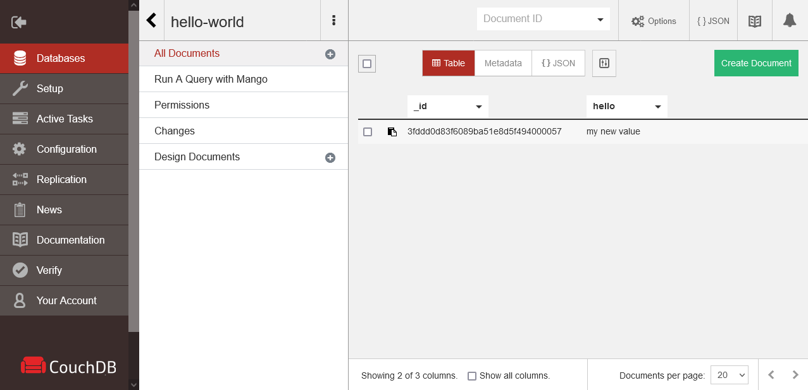

### 1.6.4
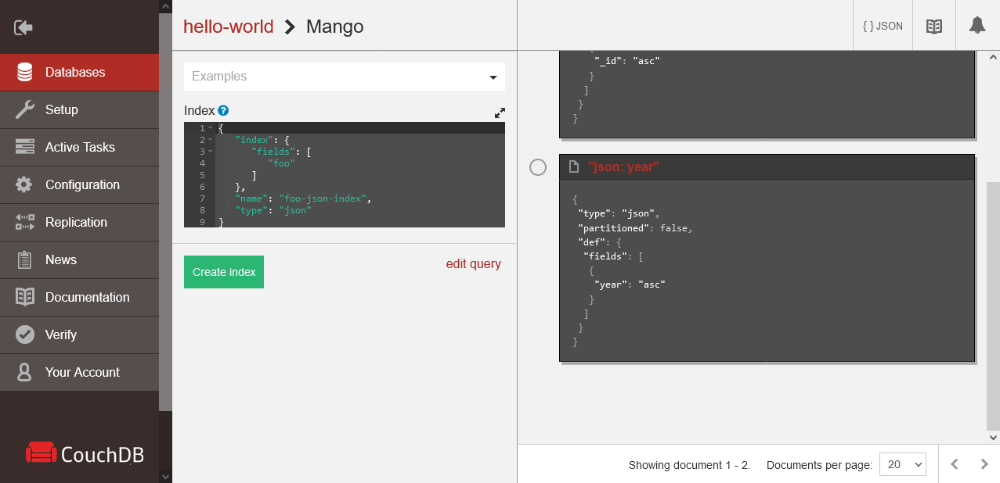

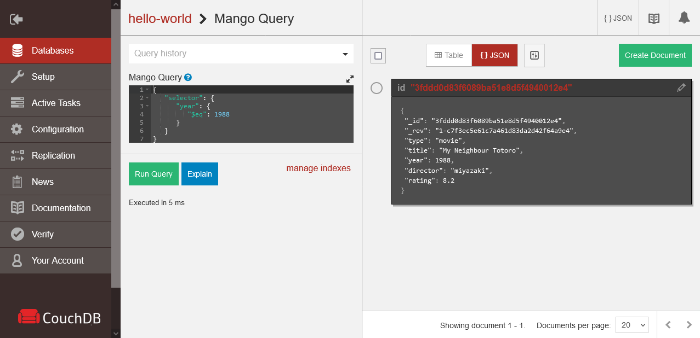

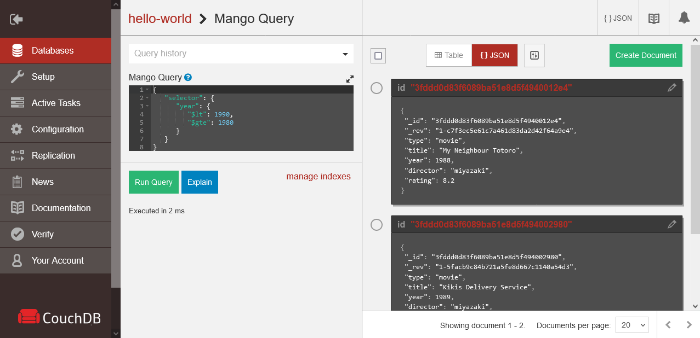

### 1.6.5
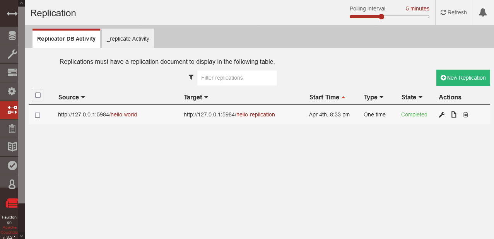

## Checkpoint 3: API Tutorial
### 1.7.1 & 1.7.2
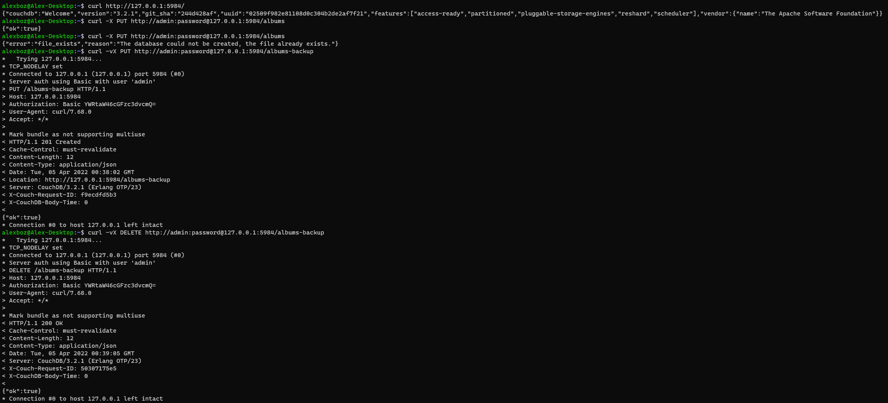

### 1.7.3
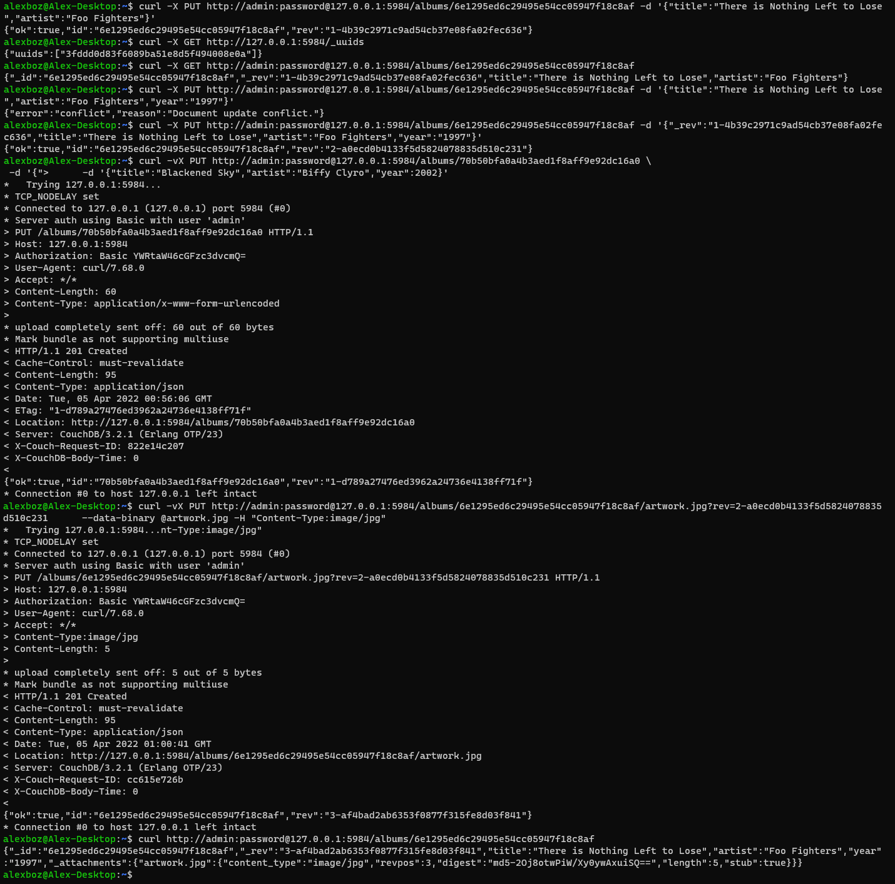

### 1.7.4
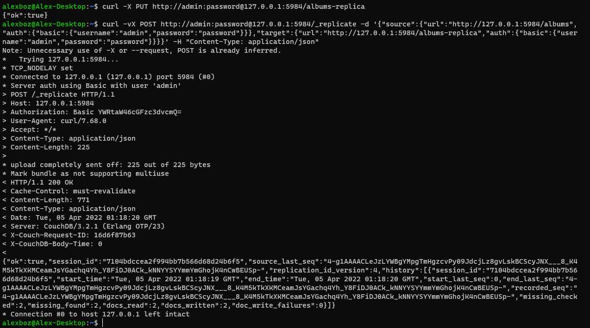

## Checkpoint 4: What Did We Miss?
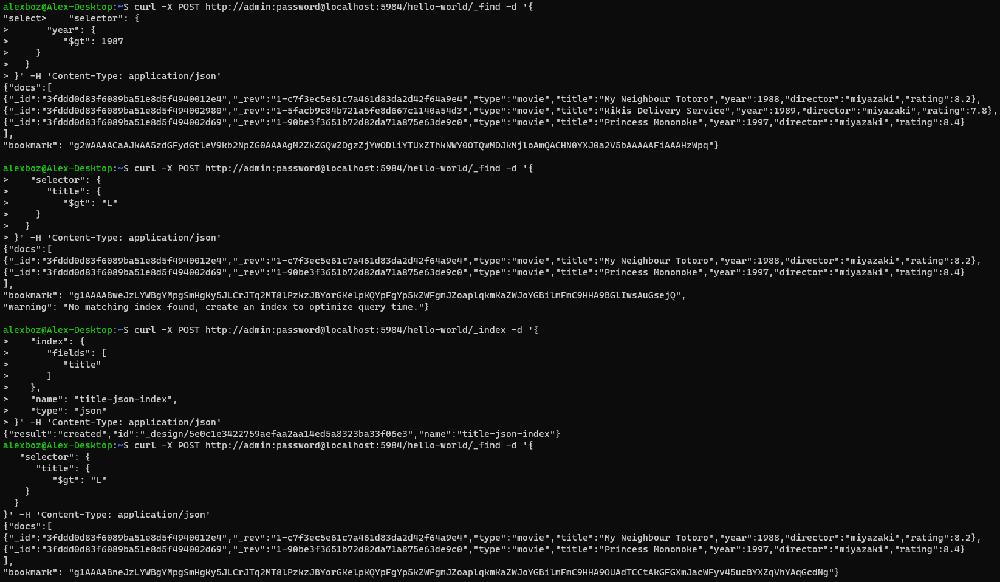
