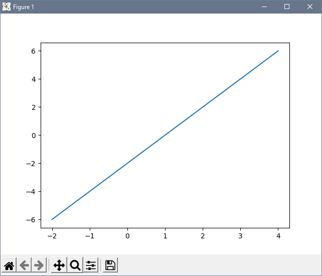
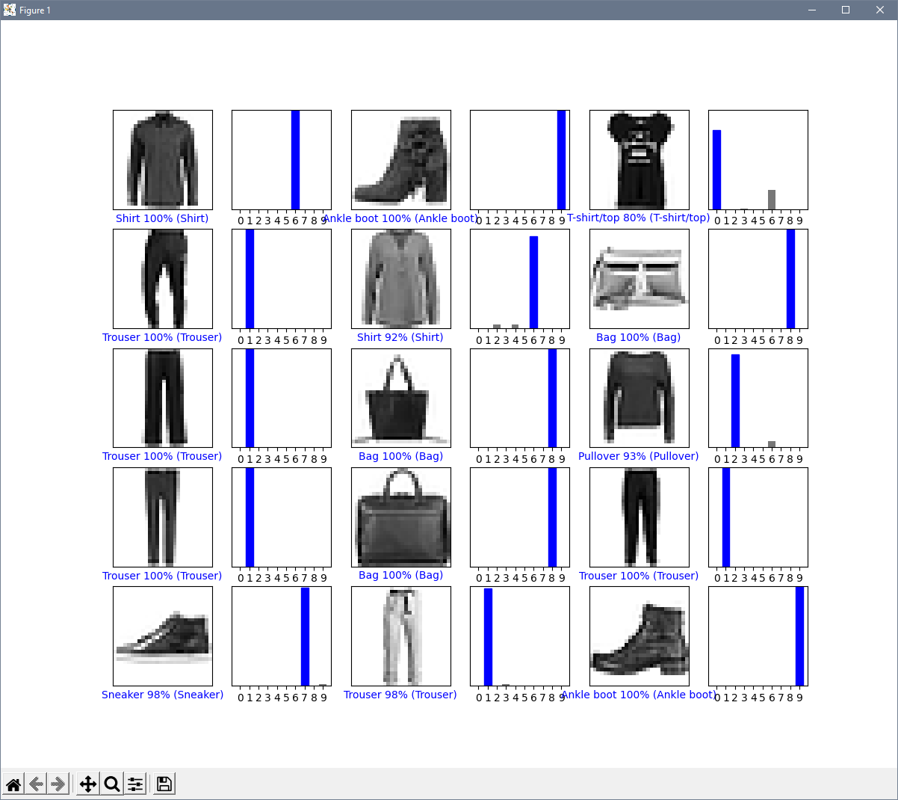
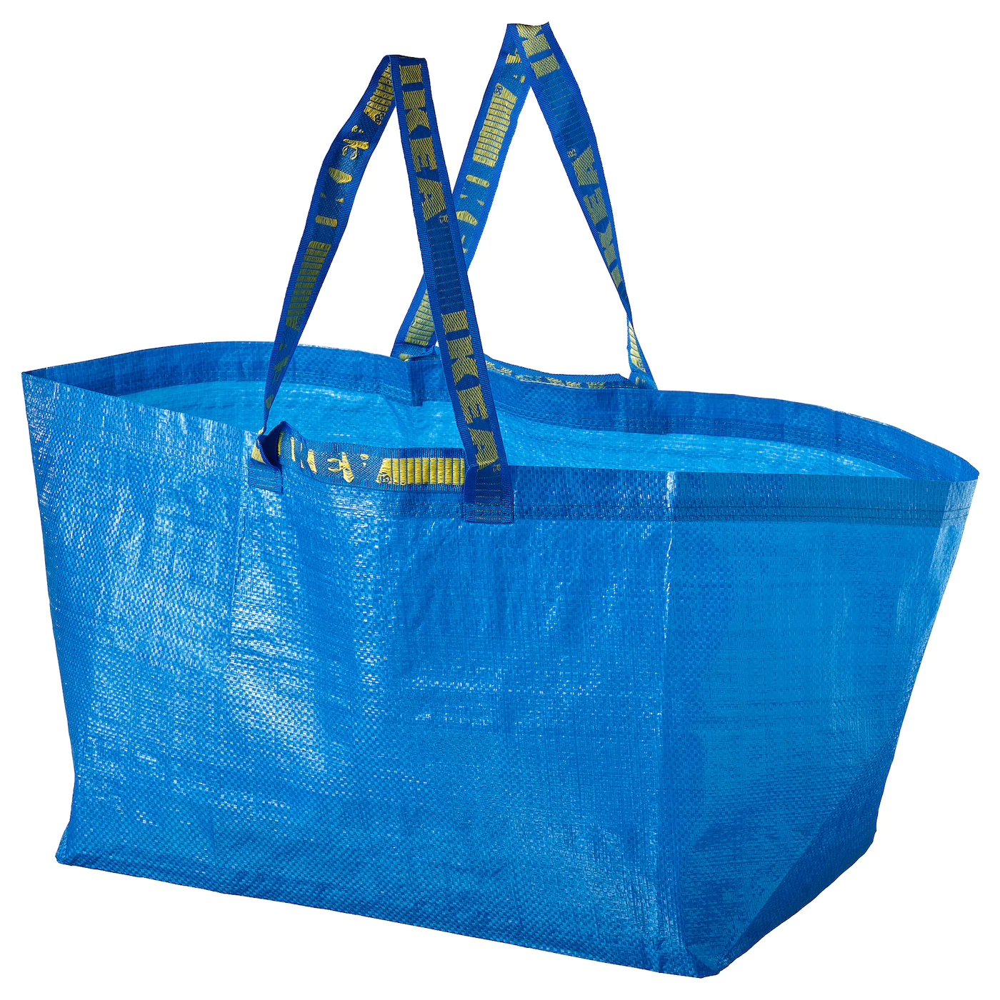
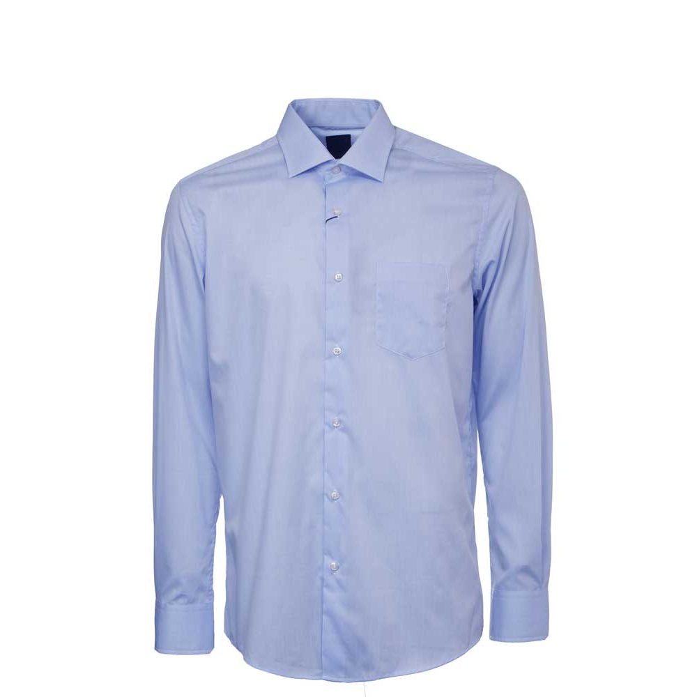
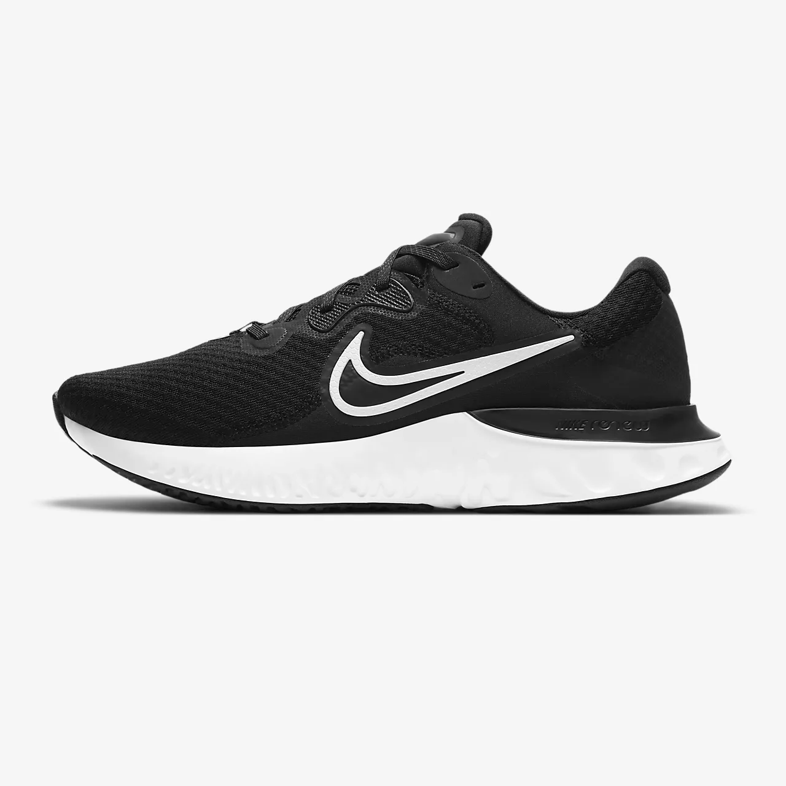
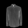

# Lab 10 - TensorFlow

## Checkpoint 1


## Checkpoint 2


## Checkpoint 3
### Original Images




### Grayscale Processed Images




### Results
Bag:
```
[1.7369445e-06 2.2573916e-09 7.4042021e-07 4.3311528e-07 1.0171754e-04
 1.4311682e-09 3.5557306e-07 1.8420419e-10 9.9989498e-01 5.0429175e-11] Bag
```
Shirt: 
```
[3.0959645e-01 4.1727177e-03 4.6122257e-02 9.4604470e-02 2.8574049e-01
 1.6485187e-03 1.6693571e-01 6.1592800e-05 9.1049619e-02 6.8183057e-05] T-shirt/top
```
Shoe:
```
[2.0301644e-02 2.3227108e-03 1.3805893e-03 2.7465359e-03 2.6954764e-03
 2.1542788e-01 8.4495610e-03 7.3625571e-01 1.0408060e-02 1.1788641e-05] Sneaker
```
